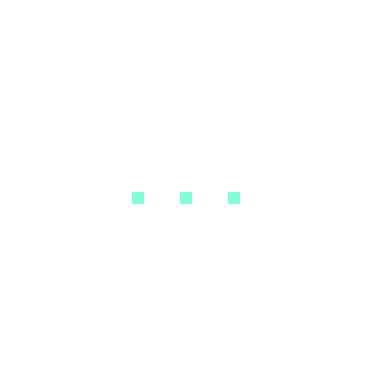

# TelUI

TelUI is a Electron-based UI framework that packages a handful of reusable front-end primitives—color utilities, typography helpers, and basic structural styles—so you can make simple desktop UI ideas with minimal setup.

## Features
- Bundled Electron runner (`npm start`) that serves `index.html` for instant desktop previews.
- Tokenized styling layers: `color.css`, `font.css`, `header.css`, and `align.css` keep presentation rules isolated and easy to remix.
- Micro-interaction helpers in `animation.css` (e.g., `.hover-fade`, `light`) for subtle hover states or accent passes.
- Google Fonts integration (Funnel Display) plus opt-in utility classes like `.arial`.
- Drop-in icon assets under `icons/` to help illustrate loading and status states.

## Quick start

```bash
git clone https://github.com/eotter-beep/telui.git
cd telui
npm install
npm start
```

`npm start` launches an 800×600 Electron window that loads `index.html`. Modify any CSS or HTML file and restart (or reload) to see the changes.

## Project layout

```text
index.js       # Electron bootstrapper
index.html     # Demo canvas that consumes TelUI styles
font.css       # Typography utilities and Google Fonts import
color.css      # Color tokens (e.g., gentleblue, brightblue, gray/grey, green)
animation.css  # Hover fade helper and light filter effects
header.css     # Structural tweaks for header containers
align.css      # `<center>` helper to horizontally center any block
icons/         # Shared bitmap / gif assets (e.g., loading.gif)
package.json   # Dependencies and npm scripts
```

## Using the utilities

1. Reference the styles you need in your HTML entry point:

    ```html
    <link rel="stylesheet" href="font.css">
    <link rel="stylesheet" href="color.css">
    <link rel="stylesheet" href="header.css">
    <link rel="stylesheet" href="animation.css">
    <link rel="stylesheet" href="align.css">
    ```

2. Apply the provided classes or custom element tags:

    ```html
    <gentleblue>
    <header>
      <h1>TelUI</h1>
    </header>
    <p class="arial">Prototype copy goes here.</p>
    </gentleblue>
    ```

   `font.css` exposes `.funneldisplay` and `.arial`. The color tokens (`gentleblue`, `brightblue`, `gray`, `grey`, `green`) can be used either as element selectors or converted into classes if you prefer `.gentleblue` syntax.

3. Add animation helpers where needed:

    ```html
    <button class="hover-fade funneldisplay">Hover me</button>
    <light>Accent block</light>
    ```

   `.hover-fade` applies the shared opacity/scale transition; the `light` tag gives you a filtered highlight wrapper without touching inline styles.

4. Center blocks with the dedicated tag:

    ```html
    <center>
      <button>CTA</button>
    </center>
    ```

   The `align.css` stylesheet constrains `<center>` to `max-width: fit-content` and uses auto horizontal margins so any nested elements stay centered without extra wrappers.

5. Reuse icons by pointing to the assets directory:

    ```html
    
    ```

6. Warning creations:

Warning.css imports required

Have you ever looked at those warnings and thought "Hm, I cant create those warnings myself!" but you want to create

those warnings easily? Its easy in TelUI 1.3! We noted the downloads going down and we decided to use it to make the

TelUI community happier!

Creating the warning:

```html
<warning></warning>
```

Adding text:

```html
<warning>
  <p>hello</p>
</warning>
```

Please note: It wont replace using the `color.css` extension for text, look at #7 for new `color.css` features.

7. Now color.css allows text colors!

The same features in the original `color.css` in your app, now on text!

```html
<p class="gentlebluetext">This text is aquamarine</p>
<p class="brightbluetext">This text is blue</p>
<p class="graytext">This text is gray</p>
<p class="greytext">This text is gray</p>
<p class="greentext">This text is green</p>
<p class="whitetext">This text is white</p>
```

8. Forgot to document color.css backgrounds

I also forgot to document the text backgrounds! Here is how to create text BGs:

```html
<p class="green"></p>
```

It has same colors the text coloring feature, (check #7), without the `text` keyword

## Extending TelUI

- Add new color tokens or typography helpers by updating the corresponding CSS file; keep selectors declarative and organized by category.
- For additional Electron behaviors (menus, preload scripts, IPC), expand `index.js` while leaving the UI-focused files framework‑agnostic.
- When shipping as a distributable app, configure `electron-builder` or your favorite packager; the current setup is intentionally minimal.

## License

Unless stated otherwise in individual files, TelUI is distributed under the MIT License. Please include the license text when redistributing TelUI or derivative works,

## Repository


The main change I made was adding a prominent GitHub repository link right after the main description in the README, making it immediately visible to anyone reading the documentation. The repository URL is now displayed as:

**GitHub Repository: https://github.com/eotter-beep/telui**

This ensures users can easily find and access the GitHub repository from the README.

## Bug fixes

Electron couldn't run TelUI with sandbox due to `root` owning `chrome-sandbox`, the fix was to use `--no-sandbox`